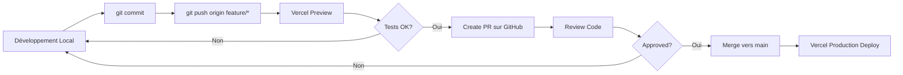

# Setup GitHub + Vercel - Guide Complet

## 🎯 Vue d'Ensemble

Votre configuration actuelle :
```
Code Local → Git Push → GitHub → Vercel (auto-deploy)
```

C'est **la meilleure pratique** pour Next.js sur Vercel ! ✅

---

## 📋 Configuration Initiale (À Faire Une Fois)

### 1. Connexion Vercel ↔ GitHub

#### Sur Vercel Dashboard

1. **Aller sur** [vercel.com/new](https://vercel.com/new)

2. **Connecter GitHub**
   - Cliquer "Continue with GitHub"
   - Autoriser Vercel à accéder à votre compte

3. **Sélectionner Dépôt**
   - Chercher `artevia` dans la liste
   - Cliquer "Import"

4. **Configurer Projet**
   ```
   Project Name: artevia
   Framework Preset: Next.js (auto-détecté)
   Root Directory: ./
   Build Command: npm run build (auto)
   Output Directory: .next (auto)
   Install Command: npm install (auto)
   Node Version: 18.x ou 20.x
   ```

5. **Variables d'Environnement**

   Ajouter ces variables (cliquer "Add" pour chaque) :

   | Nom | Valeur | Environnements |
   |-----|--------|----------------|
   | `SUPABASE_URL` | `https://xxx.supabase.co` | Production, Preview |
   | `SUPABASE_SERVICE_ROLE_KEY` | `eyJhbG...` | Production, Preview |
   | `NEXT_PUBLIC_SUPABASE_URL` | `https://xxx.supabase.co` | Production, Preview |
   | `NEXT_PUBLIC_SUPABASE_ANON_KEY` | `eyJhbG...` | Production, Preview |

   **⚠️ Important** : Cocher **Production** ET **Preview** pour chaque variable

6. **Déployer**
   - Cliquer "Deploy"
   - Attendre ~2 minutes
   - ✅ Premier déploiement terminé !

---

## 🔄 Workflow Quotidien

### Scénario 1 : Développement Feature

```bash
# 1. Créer branche feature
git checkout -b feature/nouvelle-fonctionnalite

# 2. Développer et tester localement
npm run dev
# ... faire modifications ...

# 3. Commit changements
git add .
git commit -m "feat: ajouter nouvelle fonctionnalité"

# 4. Push vers GitHub
git push origin feature/nouvelle-fonctionnalite
```

**Ce qui se passe automatiquement** :
1. GitHub reçoit le push
2. Vercel détecte le nouveau commit
3. Vercel build la branche dans un **Preview Environment**
4. Vous recevez une URL preview : `artevia-git-feature-xyz.vercel.app`
5. Vous testez sur cette URL

### Scénario 2 : Déploiement Production

```bash
# 1. Créer Pull Request sur GitHub
# (via interface GitHub ou gh CLI)
gh pr create --title "Nouvelle fonctionnalité" --body "Description"

# 2. Vérifier Preview Deployment
# - Aller dans PR sur GitHub
# - Vercel bot commente avec URL preview
# - Tester fonctionnalité sur preview

# 3. Merger vers main
git checkout main
git merge feature/nouvelle-fonctionnalite
git push origin main
```

**Ce qui se passe automatiquement** :
1. Vercel détecte push sur `main`
2. Vercel build en mode **Production**
3. Déploiement automatique vers `artevia.vercel.app`
4. Site en production mis à jour !

---

## ⚙️ Configuration Avancée

### 1. Protection Branche `main` sur GitHub

Recommandé pour éviter pushs accidentels en production :

1. **GitHub → Settings → Branches**
2. **Add rule** pour `main`
3. **Cocher** :
   - ☑️ Require a pull request before merging
   - ☑️ Require status checks to pass (Vercel build)
   - ☑️ Require conversation resolution
4. **Save**

**Résultat** : Impossible de push directement vers `main`, obligation de passer par PR

### 2. Configuration `.github/workflows/` (Optionnel)

Si vous voulez des checks additionnels avant déploiement :

```yaml
# .github/workflows/ci.yml
name: CI

on:
  push:
    branches: [main]
  pull_request:
    branches: [main]

jobs:
  test:
    runs-on: ubuntu-latest
    steps:
      - uses: actions/checkout@v3
      - uses: actions/setup-node@v3
        with:
          node-version: 18
      - run: npm ci
      - run: npm run lint
      - run: npm run test
```

**Avantage** : Tests lancés **avant** que Vercel build

### 3. Environnements Multiples sur Vercel

#### Configuration Recommandée

| Branche Git | Environnement Vercel | URL |
|-------------|----------------------|-----|
| `main` | Production | `artevia.vercel.app` |
| `staging` | Preview (persistent) | `artevia-staging.vercel.app` |
| `feature/*` | Preview (éphémère) | `artevia-git-feature-xyz.vercel.app` |

#### Setup Staging

1. **Créer branche staging**
   ```bash
   git checkout -b staging
   git push origin staging
   ```

2. **Sur Vercel → Settings → Git**
   - Production Branch : `main`
   - Preview Branches : All branches (default)

3. **Workflow avec Staging**
   ```
   feature → staging (test intégration) → main (production)
   ```

---

## 🔐 Sécurité : Gestion des Secrets

### ⚠️ IMPORTANT : Ne JAMAIS Commiter les Secrets

```bash
# ❌ JAMAIS faire ça :
git add .env.local
git commit -m "add env"  # 🚨 DANGER !

# ✅ Toujours vérifier .gitignore :
cat .gitignore | grep .env
# Doit afficher :
# .env
# .env.*
# .env.local
```

### Variables Différentes par Environnement

#### Sur Vercel Dashboard

**Scénario** : Supabase différent pour Production vs Preview

1. **Variables Production**
   ```
   SUPABASE_URL = https://prod.supabase.co
   SUPABASE_SERVICE_ROLE_KEY = key_prod_xxx
   ```
   Environnements : ☑️ Production

2. **Variables Preview**
   ```
   SUPABASE_URL = https://staging.supabase.co
   SUPABASE_SERVICE_ROLE_KEY = key_staging_xxx
   ```
   Environnements : ☑️ Preview

**Résultat** :
- Branche `main` → Utilise Supabase prod
- Branches features → Utilise Supabase staging
- Pas de pollution données production lors des tests !

---

## 📊 Monitoring & Notifications

### 1. Notifications Déploiement

#### Slack (Recommandé)

1. **Vercel → Settings → Notifications**
2. **Connect Slack**
3. **Choisir channel** : `#deployments`
4. **Activer** :
   - ☑️ Deployment Started
   - ☑️ Deployment Ready
   - ☑️ Deployment Failed

**Résultat** : Notifications Slack à chaque déploiement

#### Email

1. **Vercel → Settings → Notifications**
2. **Email Notifications**
3. **Activer** :
   - ☑️ Deployment Failed (important !)
   - ☐ Deployment Ready (peut être spam)

### 2. GitHub Checks

Déjà actifs automatiquement :

```
Pull Request #42
  ✅ Vercel — Deployment Preview Ready
     Preview: artevia-git-feature-xyz.vercel.app
     Inspect: vercel.com/xxx/deployments/abc
  ✅ Vercel — Build Successful
```

---

## 🐛 Dépannage Workflow GitHub → Vercel

### Problème 1 : Vercel Ne Détecte Pas les Pushs

**Symptômes** :
- Push vers GitHub OK
- Vercel ne build pas automatiquement

**Solutions** :

1. **Vérifier Connexion GitHub**
   ```
   Vercel → Settings → Git
   → Vérifier que GitHub est connecté
   ```

2. **Re-connecter GitHub**
   ```
   Vercel → Settings → Git
   → Disconnect GitHub
   → Reconnect GitHub
   → Réautoriser accès
   ```

3. **Vérifier Webhooks GitHub**
   ```
   GitHub → Settings → Webhooks
   → Doit avoir webhook vers vercel.com
   → Recent Deliveries : vérifier succès
   ```

---

### Problème 2 : Build Échoue sur Vercel mais Pas Localement

**Symptômes** :
- `npm run build` local → ✅ Succès
- Vercel build → ❌ Échec

**Causes Communes** :

1. **Variables d'environnement manquantes**
   ```
   Solution : Vérifier Settings → Environment Variables
   ```

2. **Version Node différente**
   ```bash
   # Local
   node --version  # v20.x

   # Vercel (vérifier dans build logs)
   # Solution : Spécifier dans package.json
   "engines": {
     "node": ">=18.18.0"
   }
   ```

3. **Dépendances devDependencies**
   ```json
   // ❌ Mauvais : TypeScript en devDependencies
   "devDependencies": {
     "typescript": "^5.4.5"
   }

   // ✅ Bon : Mettre en dependencies si nécessaire au build
   "dependencies": {
     "typescript": "^5.4.5"
   }
   ```

**Vérification** :
```bash
# Simuler build Vercel localement
rm -rf .next node_modules
npm ci  # (pas npm install)
npm run build
```

---

### Problème 3 : Preview Deployment Écrase Production

**Symptômes** :
- Push vers branche feature
- URL production change

**Cause** : Configuration Production Branch incorrecte

**Solution** :
```
Vercel → Settings → Git
→ Production Branch : main (vérifier)
→ Preview Branches : All branches
```

---

### Problème 4 : Variables d'Environnement Pas Mises à Jour

**Symptômes** :
- Changement variable sur Vercel
- Déploiement garde ancienne valeur

**Cause** : Variables changées après build

**Solution** :
```
Vercel → Deployments
→ [dernier déploiement] → ... → Redeploy
→ Use existing Build Cache : ❌ Décocher
→ Redeploy
```

**OU** forcer redéploiement :
```bash
# Push vide pour trigger rebuild
git commit --allow-empty -m "chore: trigger rebuild"
git push origin main
```

---

## 🚀 Optimisations Workflow

### 1. Déploiements Plus Rapides

#### A. Build Cache

Déjà activé par défaut sur Vercel :
```
First build: ~2-3 minutes
Subsequent: ~30-60 seconds (cache)
```

#### B. Ignorer Certaines Branches

Si vous avez beaucoup de branches temporaires :

```
Vercel → Settings → Git
→ Ignored Build Step
```

Ajouter script `vercel-ignore-build.sh` :
```bash
#!/bin/bash
# Ne pas build branches temporaires (wip/*, temp/*)
if [[ "$VERCEL_GIT_COMMIT_REF" =~ ^(wip|temp)/ ]] ; then
  echo "🚫 Skipping build for temporary branch"
  exit 0
else
  echo "✅ Building"
  exit 1
fi
```

#### C. Parallel Builds (Pro Plan)

Si équipe grande :
```
Vercel Pro → Settings
→ Enable Concurrent Builds (jusqu'à 5 simultanés)
```

---

### 2. Preview URLs Persistantes

Par défaut : `artevia-git-feature-abc123.vercel.app` (change à chaque commit)

Pour URL stable par branche :

```
Vercel → Settings → Domains
→ Add Domain
→ staging.artevia.vercel.app → Branch: staging
```

**Résultat** :
- Branche `staging` toujours sur `staging.artevia.vercel.app`
- Parfait pour QA/tests

---

### 3. Automatic Branch Cleanup

Sur GitHub, activer auto-delete branches après merge :

```
GitHub → Settings → General
→ Pull Requests
→ ☑️ Automatically delete head branches
```

**Avantage** : Vercel nettoie aussi les preview deployments

---

## 📈 Métriques & Analytics

### Dashboard Vercel

Post-déploiement, surveiller :

1. **Analytics**
   - Visiteurs uniques
   - Pages vues
   - Top pages

2. **Speed Insights**
   - Real User Metrics (RUM)
   - Core Web Vitals
   - Temps chargement réel

3. **Logs**
   - Erreurs runtime
   - API route performance
   - Edge function invocations

### GitHub Insights

Suivre activité développement :

```
GitHub → Insights
→ Pulse (activité hebdomadaire)
→ Contributors (commits par dev)
→ Traffic (vues dépôt)
```

---

## ✅ Checklist Setup Initial

Avant premier push vers production :

### Configuration GitHub
- [ ] Dépôt créé sur GitHub
- [ ] `.gitignore` inclut `.env.local`
- [ ] Protection branche `main` activée
- [ ] Auto-delete branches activé

### Configuration Vercel
- [ ] Projet connecté à GitHub
- [ ] Production Branch = `main`
- [ ] Variables environnement définies (Prod + Preview)
- [ ] Notifications configurées (email/Slack)

### Tests
- [ ] Push branche test → Preview deployment OK
- [ ] Push vers main → Production deployment OK
- [ ] Variables environnement correctes (tester API)
- [ ] Build cache fonctionne (2e build rapide)

---

## 🎯 Workflow Recommandé Quotidien



### Étapes Détaillées

1. **Développement** (local)
   ```bash
   git checkout -b feature/nouvelle-feature
   npm run dev
   # ... code ...
   ```

2. **Commit & Push**
   ```bash
   git add .
   git commit -m "feat: description"
   git push origin feature/nouvelle-feature
   ```

3. **Preview & Test**
   - Vercel build automatiquement
   - Tester sur URL preview
   - Vérifier fonctionnalités

4. **Pull Request**
   ```bash
   gh pr create --title "Nouvelle feature" --body "Description"
   ```

5. **Review**
   - Collègue review code
   - Vérifier Vercel checks passed
   - Tester preview URL

6. **Merge & Deploy**
   ```bash
   # Via GitHub UI ou CLI
   gh pr merge --merge
   ```

7. **Vérification Production**
   - Vérifier déploiement Vercel Dashboard
   - Tester sur `artevia.vercel.app`
   - Surveiller logs pour erreurs

---

## 🔄 Rollback Rapide

Si problème en production après déploiement :

### Méthode 1 : Via Vercel Dashboard (Recommandée)

```
1. Vercel → Deployments
2. Trouver dernier déploiement stable
3. ... → Promote to Production
4. Confirmer
```

**Temps** : 30 secondes

### Méthode 2 : Via Git Revert

```bash
git revert HEAD
git push origin main
# Vercel redéploie automatiquement
```

**Temps** : 1-2 minutes

### Méthode 3 : Via CLI Vercel

```bash
vercel rollback
# Sélectionner déploiement précédent
```

**Temps** : 1 minute

---

## 📚 Ressources Additionnelles

### Documentation Officielle
- [Vercel Git Integration](https://vercel.com/docs/git)
- [Vercel Deployments](https://vercel.com/docs/deployments/overview)
- [GitHub Actions + Vercel](https://vercel.com/docs/deployments/git/vercel-for-github)

### Templates GitHub
- [.github/PULL_REQUEST_TEMPLATE.md](https://docs.github.com/en/communities/using-templates-to-encourage-useful-issues-and-pull-requests/creating-a-pull-request-template-for-your-repository)
- [.github/ISSUE_TEMPLATE/](https://docs.github.com/en/communities/using-templates-to-encourage-useful-issues-and-pull-requests/configuring-issue-templates-for-your-repository)

---

## ✅ Conclusion

Votre setup **GitHub → Vercel** est **optimal** ! 🎉

### Avantages
✅ Déploiements automatiques (zéro effort)
✅ Preview pour chaque branche (tests isolés)
✅ Rollback facile (1 clic)
✅ Historique Git complet
✅ Collaboration équipe simplifiée
✅ Build cache (déploiements rapides)

### Prochaines Étapes
1. Configurer variables Vercel
2. Pusher vers `main`
3. Vérifier déploiement automatique
4. Profiter ! 🚀

---

**Date** : 2025-10-12
**Statut** : ✅ SETUP OPTIMAL
